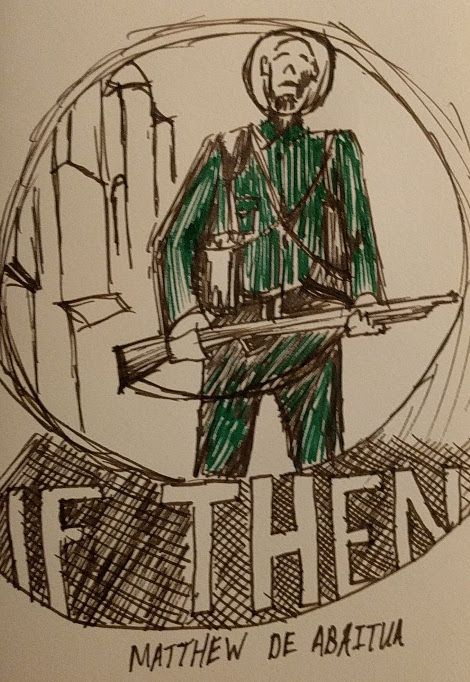

# If Then - Matthew Abaitua

__In Progress__

James Marshall

"If Then" is the best interpretation of a post singularity world that I've read. How we got there isn't covered, but it's happened and the residents of a small British town are doing their best to deal.

I hesitate to say more because I came into this book blind and loved it more because of it. So I'll stick to the cover: a World War I Soldier stands bewildered.

And a tangent on covers: this is a good way to judge books. It's not perfect, but better than popular sayings would have you believe. Publishers know that this may be your only encounter with the book, so they are trying to communicate everything they can in one picture. A good publisher is paying attention to the cover. If you find a cover appealing, there's a good chance that you are the target market. A penguin thrift classic whatever has a cover that shouts "this is a book you may not like but you _Should read_ by cropping some Victorian piece of art over some Todo studied serifed title. "If Then" had a fucking great cover that is disorientating; it throws a WW soldier over a quiant street that's obscured by a reticle's dark future. Todo illustrator did a great job on all three books if this loose trilogy. I haven't read the others yet...

Back to the book in a round about way. The central premise seemed weak at first, even though I bought into the world completely. But now, weeks later, I'm still thinking about this story. And the premise has started to ring true. It's hard to imagine a world in which we have writers like Vonnegut or Hemingway without the wars of the early century. Our contemporary authors are almost odd in their lack of strife. Turmoil and suffering marks people in a way that leads some to ink. The premise that a single soldier is important is born out by the shelves of our libraries.

And the way this book treats the singularity is spot on. Todo Knuth? Has said that to personify a program is a sign of immaturity, and Todo author avoids this trap. The programs that bring about the singularity and survive after are a character, but never a person. This isn't just a matter of swapping "he / she" with "it." Todo author never pushes us to make it human. The description isn't exact, but the lack of precision is a feature: the broad strokes are believable and don't distract or delegitimize the story. Instead, we are able to emphathize with the survivors, who hardly know the machinations behind their own fate. They know what happened and the result, but never the exact why.

And as the older folks may remember the world as we know it today, they watch as their children grow up in a new normal that the adults can't really adapt to. This is an idea also touched in by Todo author Station 11, Todo check, another standout of this genre.

This is not all to say that the book was perfect for me. The finish was not strong. Without giving anything away, once I spotted the trajectory, I was left reading knowing that I would dislike the conclusion but carried on regardless because I still loved the world in which it was happening. 

Overall, the first half was enthralling as you learn about this well crafted world and the sympathetic if imperfect protagonists. The second half disorients you, in a good way at least at first. And if you love the characters and world as much as I did, that will be enough to carry you through to the end, which you'll probably find just fine. But it's a fine proceeded by great.

