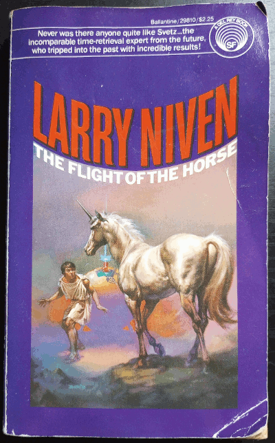

__In Progress__

Someone in my town has been dumping their collection of old sci fi paperbacks in our local "little free library."
And I love it.
While some classics pop up, or at least classic authors as is the case with this find, more often than not what I grab is by an unknown (to me) author with an absolutely outlandish cover.
The best cover I've found to date is a man sword fighting a bored unicorn.

This is where I found ... by Niven, author of Ring World...

Not really a book, but a collection of stories... what was going on with publishing?

Check the afterword: it's all fantasy (Glass Dagger obviously so).

So far this is a review around the book... what of the stories themselves?

Playboy anecdote...

Time travel...

Teleportation...

Glass Dagger... this is the most "fantasy" of them all and for me the most enjoyable...
