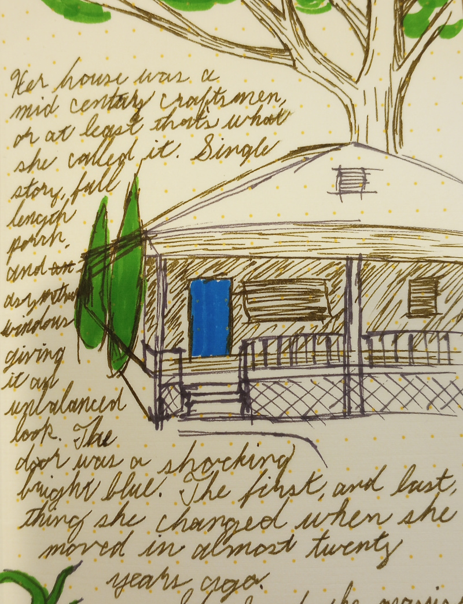

Note: Mixing in new text with the old. Lots to edit. I originally tried to make this shorter, but honestly, it needs to be longer.

TODO: Find the notebook illustration of her house and short description.

TODO: Drop the HOA thing. Really?

Think of Mariana's student that was pissed Mar wasn't doing more to save the world.

---

Her house was a mid-century craftsmen, or at least that's what she called it. Single story, full length porch, and asymetrical windows giving it an unbalanced look.

The door was a shocking blue. It was the first, and last, thing she had changed when she moved in almost twenty years ago.

She loved the massive oak that shaded the back. That too would be consumed by the vines.

---

"You're a bird that doesn't care for heights."

"Never figured you for the poetic type."

"Maybe you aught to be doing more figuring then."

---

"It's time to wake the fuck up. This is happening. Are you watching or helping?"

---

She put in her days, then came home to tend her garden. Out back, not visible from the quiet suburban street.

---

It was the home owners associations of all things that sounded the alarm. The retirees on the boards tried everything they could to coerce their neighbors to do something about the encroaching vines. But soon not even the most dedicated busy bodies could keep up with the wild growth.

That's not entirely true; the scientists had been sounding the alarm and writing letters and holding conferences for years. But no one was paying them any attention. Those in power found doubt more convenient than action.

So the vines took over. Twirling tendrils extended and wrapped around and choked everything. If no structure was available, they twirled around themselves forming braided branches that stretched out in all directions. Broad leaves blocked out light.

Everyone tried to do their own individual part, hacking away with machetes and trying useless weed killers and bleach when that still didn't work. The vines seemed to grow back overnight. They overtook the native species easily, and then the aggressive invasive species after that.

Sarah remembered with dread when she saw the first tendrils drooping across the hedge that separated her yard from the neighbor's. She had an emergency plan, but never really thought she would have to use it. Biologist and chemist, she knew that the elevated levels of CO2 in the air made the vines spread that much faster. It was as if the vines had adapted specially to take advantage of the CO2 as a building block like no other plant had been able to.

She had topped of her cistern, bolted her doors, and prepared to wait out the worst of it. She just prayed that fires didn't reach her house.

And so she waited out the food riots that came that fall when farmers across the world lost half of their yield to vines taking over their fields. Prices soared and rich nations devoured their own food aid while poor nations devoured their own. And Sarah sat listening to reports on her battery powered radio while eating tins of beans and potted meat.

The house was dark even during the day as the vines covered the windows. Each day she trimmed back the tendrils that crept in under the door and through loose joints in her old wood house.

She slept through the roving band of starving bandits that ransacked her neighborhood. They couldn't even tell that there was a house under the dense cover of vines.

On a few occasions she heard muffled calls and screams.

Until finally her food and water dwindled. The radio had stopped broadcasting before she ran out of batteries. And so it was time for her to strike out for the desert.

When she opened the door, there was nothing but a mass of vines, dark green and turning brown lower down. She hacked away with a chef's knife, piling the detritus in the living room.

It took hours to make it off her porch, at which point she started to angle upwards towards the dim glow of the noon day sun filtering through. All the way she was stepping on crickets, millipedes, spiders, and gigantic slugs. Some where the size of her forearm. The ground became slick with their mucus as she cut and trampled them.

She didn't even break through that day. Instead she left the last layer of fresh green vines with their broad leaves for the morning. She ate her last can of tuna fish plain, and slept deeply. Her muscles all ached from the day of effort after her long hibernation.

---

That was two months ago. Before she scavenged a machete from a corpse. Before she learned to forage water from compressing young vine shoots. Before she became accustomed to the taste of the slugs.

Before she met Sammie, the orphan that followed her for a day before she finally shared her food.

"Lucy? Why are we going to the desert."

She, Lucy, scanned the horizon as they walked. She told the girl, "Because the vines can't live there."

"Can we live there? It's hot. And dry. I learned that in school."

"Yes, we can live there. My ancestors did. They could find water. And shade."

They were trudging through a long winding valley, about one hundred yards across, meandering like a slow river through hills of vines. Lucy imagined that it was likely a road or highway beneath them, and the hills on either side used to be forests that had since been covered by the vines.

It made for faster travel, but it made Lucy nervous. Other folks may also be traveling along it. "But to the desert?" She wondered, "Where does anyone travel now?" She wasn't all that sure they were heading the right way. Maps where useless without landmarks, so she just kept moving south and west.

Lucy still knew little of how the cities faired. Sammie, she thought, might know more, but Sammie refused to talk about her past beyond a few vague statements about being hungry.

They broke for camp, trekking away from the covered road for about five minutes. Lucy began hacking at the vines, peeling them back and hacking away until she had a large enough flap that she could prop it up with some hiking poles forming a lean-to. She spread out a tarp inside to help keep them dry and keep the bugs out.

Meanwhile Sammie hunted for their dinner. She wondered around the vine canopy, looking for broad leaves that were covered in mucus or sagging, indicating a plump slug on the underside.

Returning to camp, Sammie asked, "Fire tonight?" Sometimes they could find dry tinder if hacked deep enough into vines.

"Not tonight," Lucy told her. Lucy didn't add that she was worried about other travelers spotting them.

"We never have fires. It's cold."

Lucy smiled and said, "Yes, but we'll have fires and be warm in the desert."

They ate the slugs cold. Lucy hated it; had to choke down every bite. But Sammie never complained about food.

After they ate the curled up together in the lean-to with there heads out, watch the stars before they slept.

The sky was clear, and the sky was glorious. The Milky Way stretched out in colors and brilliance that Lucy had never seen in her previous life.

"Lucy, why do the vines grow?" Sammie asked, as she always did.

"To punish us, and make us wise again."

"Wise?" Of all the tales Lucy would tell, Sammie hadn't heard this one before.

"Yes. To teach us to live off of the land again."

"You mean like eating slugs?"

Lucy was silent. Eventually Sammie asked, "What do you mean by punish?"

Lucy pulled in a deep breath and said, "We messed it all up Sammie. We destroyed the ecosystem. The whole Earth. So the Earth is punishing us. For pollution and climate change and caring more about what we produced than what we used."

"Lucy, what do..."

Lucy cut her off, "Go to sleep Sammie. We have a long walk tomorrow." They always had a long walk.

---

In the morning, Lucy could see smoke to the north. Not thick or billowing, but wispy and hazy. She rushed to wake Sammie and pack.

"I'll get some slugs," Sammie said as she started to wander from camp.

"No! We have to get going, now."

Sammie was silent and started packing, but Lucy could see that she was crying.

They made it back to the covered road, and started walking at a brisk pace. Lucy was thirsty and hungry, and she knew that Sammie must be as well, but they kept going.

Lucy knew what the smoke meant. It wasn't a small fire like a burning house or even town. It stretched the entire horizon. It was the next phase.

All of the biomass trapped beneath the vines, grass, trees, forests, wood houses, pets, people, and even the vines themselves where burning. Or rather smoldering.

The hills on either side of the road where diminishing. The forest beneath must have ended. They saw a few lumps, maybe houses? Lucy took out her compass and kept leading them to the southwest.

The wet vine canopy starved the fire below of oxygen. So it smoldered. It was the basic process for making charcoal. All of the carbon in the biomass was being concentrated. The vines themselves had pulled CO2 out of the air, and now that was turning into charcoal as well.

Lucy knew that eventually it would all turn into a rich, thick soil. Some would be farmed, but most would remain buried, maybe fore millennium. The vines and the fire together were making for the largest carbon sequestration event in the Earth's history.

But for right now they had to escape it, stay ahead of the smoldering fire under the canopy. Lucy did not think they could survive the heat or the fumes.

Luckily it seemed that the fire was spreading slower than the could walk, and the haze on the horizon faded slowly. Still, Lucy thought, the fire didn't rest, they would have to.

---

Finally, they came to the edge of the desert. Tendrils of vine whithered over coarse sand. The first sight of ground they had seen since before the vines.

They were exhausted and thirsty. Their eyes and throats burned from the thick haze.

"What do we do now?" asked Sammie.

"I'll collect vines for water," Lucy answered, "and you collect slugs. They we walk." Sammie started to protest, but Lucy cut her off, "We have to walk. We have to get away from the smoke."

And so they walked. Stumbled across scrubby dunes, coarse stones, between squat cactus. They soon finished their water, but could at least breath easier.

Sammie looked to Lucy and asked, "How do we find water? How did your ancestors live here?"

Lucy shook her head. "I don't know," she whispered.

"How are we going to survive here? What will we eat?"

"I don't know."

They rested during the afternoon, sleeping as well as their empty stomachs would allow under a narrow rock overhang, the only shade they could find.

In the evening they began walking again. Lucy hacked into the base of a cactus, trying to find water, but what little was there smelled fetid.

They were cresting a low rise when they heard a commotion ahead and then a shout, "Halt!"

Lucy crouched low, machete in hand, while Sammie shrunk behind her. A spotlight flipped on, blinding Lucy.

A voice came from the direction of the spotlight, "Lay down your weapon. We are armed."

Lucy slowly lowered the machete. She called into the blinding light, "Are you military?" Silence. "C.I.A? Tell your commanding officer the Doctor Lucile Fanning is reporting for duty."

Lucy brought Sammie to her in a hug and whispered, "They will take you now, but don't be afraid. You made it. We made it."

Sammie was crying silently as a soldier led her way from Lucy, who was taken into the command center for what remained of the US military.
